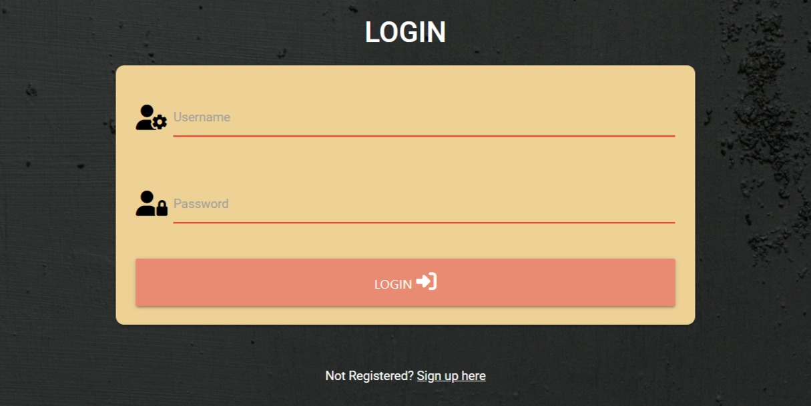
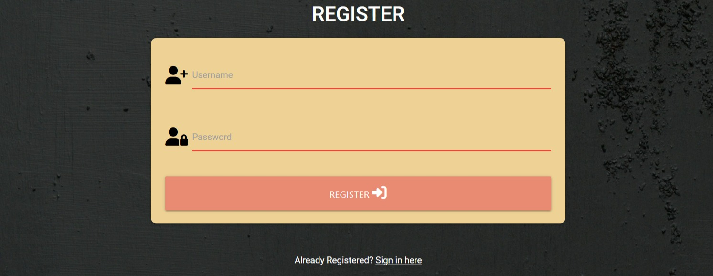
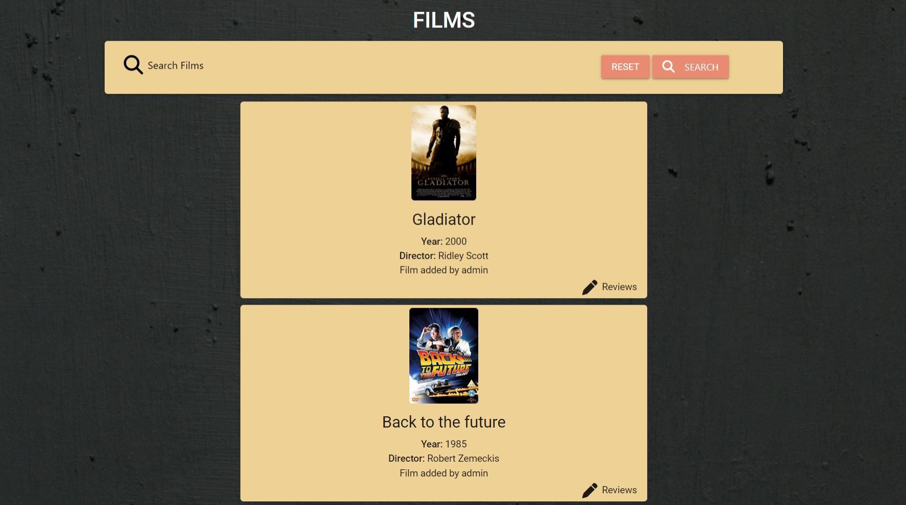
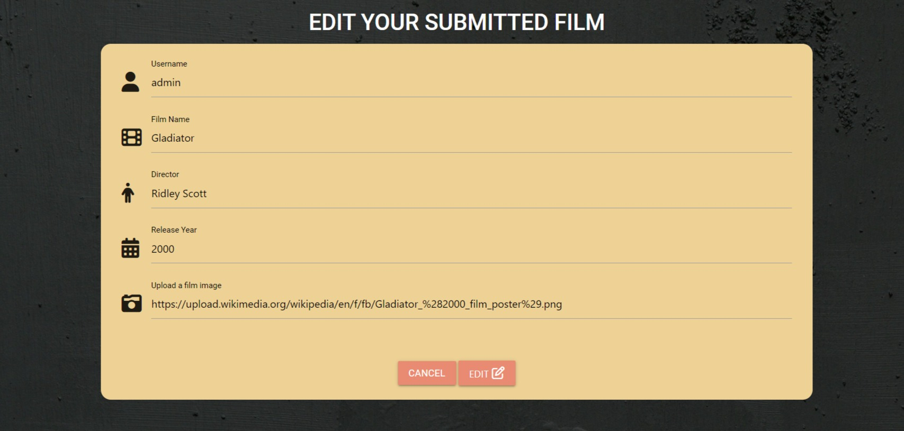
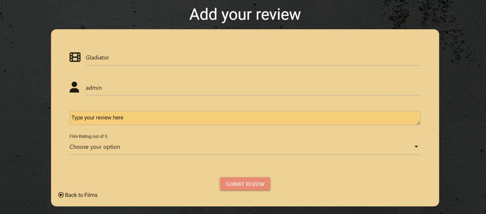
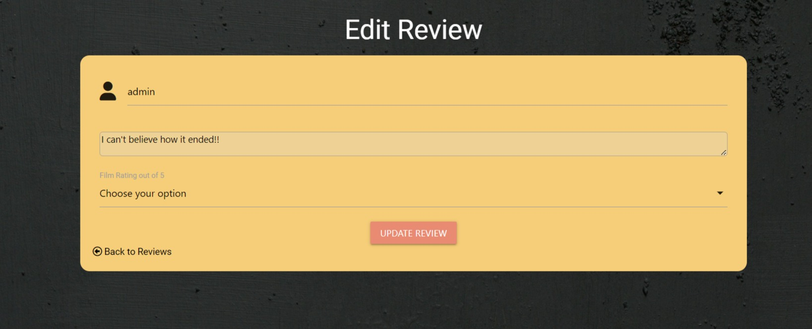
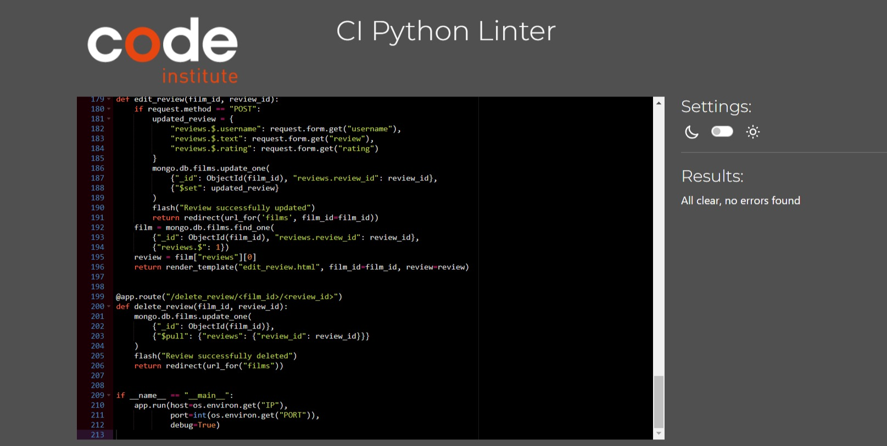

# Film Fanatic
## Introduction
The purpose of this website is for people to see other peoples reviews of films. But also for users to be able to add their own reviews to films. The site is aimed at people who often watch films and want to find films to watch and see what others have said about them. If there is a new film not on the website users will be able to add it. 


## Features 
* Navigation bar
    * A simple navigation bar is at the top of the page for users to easily go through. 


* Home page
    * The home page is very simple if the user is not logged in it will show a login or register button.
    * If the user is logged in it will show a log out button. 


* Login page
    * The login page will have a panel for users to input their username and password and a login button.



* Register page
    * The register page is similar to the login page but has register button instead. 



* Films page
    * This is the main page of the website where all the films are displayed with a dropdown button for users to see the reviews of that film selected. 
    * There is also an option for the user to add a review or edit one of their previous reviews.
    * At the top of the page there is a search bar so users can find a film.
    


* Add film 
    * This page users can add new films that are not already on the website. 


* Edit film
    * A user can edit a film they previously added on this page. 



* Add review 
    * A form for users to add they're own review to a film.



* Edit review
    * A user can change or edit they're review if they decide to. 



* Flash messages
    * When the user logs in or adds a film a message will display at the top of the website. 


## User Experience

### First time visitors
* As a first time visitor I want to see the films and I want to be able to search for a film.
* I want to be able to see what people have said about certain films.
* I want to be able to create my own account so I can review films in the future.

### Second time visitors
* As a second time visitor I want to be able to log into my account.
* I want to be able to review a film I have watched.
* If the film I watched isn't on the website I want to be able to add it. 

### Design Choices
* Colour Scheme
    * The two main colours used on this website are #e98b72 which is an orange colour and #eed195 which is a yellow colour. These colours were chosen to add a fun and proffessional look on top of a dark background. 
    
* Typography
    * The font used was Roboto, with sans-serif set as a back up font. Roboto was used as it has an easy readibility and has a clean and modern design.

* Imagery
    * The background image used was taken from unsplash, linked below in the acknowledgements section. 

    
### Flow chart
* Here is a flow chart of how I wanted the website to work. [Flowchart](documentation/readme/basic-flowchart.jpg)


### Wireframes
* All wireframes were created using Balsamiq wireframes, all designs for desktop are shown and one of the mobile as the only thing to change on small screens is the navbar as you can see [here](documentation/readme/milestone-project-3.png)

## Database design
* The Films Fanatic website uses a non relational database on mongodb. 
* The database contains 2 collections
    * films
        * Contains the films with all information
        * Also contains the reviews for those films
    * users
        * Contains user information, passwords and usernames

### Testing
#### Functional Testing
* Creating a user
    * This works as it should. A user can be created if the username does not already exist. 
    * When created the user is shown a welcome message and directed to the films page.
* Logging in as user 
    * Similarly to register the user is shown a welcome message and directed to the films page.
    * If the username or password was wrong or does not exist the user is shown an incorrect password or username message. 
* Logging out
    * The log out button is clicked and the user is logged out and taken back to the login page. 
    * The user is also flashed a you have been logged out message. 
* Add review
    * The add review button is clicked and the user is taken to the add review page.
    * Username and film name is automatically rendered.
    * The user can leave a review and a rating score.
    * Once submitted the user is taken back to the films page and their review will appear on the corresponding film they added it to. 
* Edit review
    * If the user is the creater of the review they are given the option to edit it.
    * Click edit review takes them to the edit review page.
    * When submitted their review updates. 
    * Message shown saying their review is updated. 
* Delete review
    * When clicked the users review is deleted.
    * Also shown a message to say that their review has been deleted. 
* Add film 
    * Add film button takes user to add film page.
    * Form for adding films is displayed with the users name automatically rendering. 
    * User can fill out form, but can't submit it unless all fields are filled in. 
    * When submitted the film is then displayed on the films page. 
* Edit film 
    * Only displayed if user is the creator of the film. 
    * All inputs are automaically rendered in the form. 
    * When edited they are then displayed a your film has been edited message. 
* Delete film
    * Only displayed for the film creator.
    * Once clicked the user is displayed a film deleted message. 
    * This deletes all reviews associated with that film.
* Search bar
    * If a film exists it is shown by searching for it.
    * If it doesnt exist it will show no results found and will shows a button to add their film.
* Navbar testing
    * All navbar links take the user to the correct place, on both small and large screens. 
* CRUD testing
    * Testing on the add/edit/delete buttons was done to make sure there was no crossovers effecting each other. All work as intended. 

### Validator testing
* PEP 8 Online
    * This validator Service was used to validate the python file in the project to ensure there were no syntax errors in the project. The results were all clear as shown below. 
    <details>
        <summary>PEP 8</summary>
        
    </details>

* The W3C CSS validator and the W3C Markup Validator were used to validate every page of the project to make sure there were no syntax errors.
* [W3C CSS Validator](https://jigsaw.w3.org/css-validator/#validate_by_input) [Result](documentation/readme/css-valid.jpg)
* [W3C Markup Validator](https://validator.w3.org/) - Results for each page are below
    * [Home page](documentation/readme/homepage-validation.jpg)
    * [Films page](documentation/readme/films-validation.jpg)
    * [Add film](documentation/readme/add-film-validation.jpg)
    * [Edit film](documentation/readme/edit-film-validation.jpg)
    * [Add review](documentation/readme/add-review-validation.jpg)
    * [Edit review](documentation/readme/edit-review-validation.jpg)
    * [Login](documentation/readme/login-validation.jpg)
    * [Register](documentation/readme/register-validation.jpg)
* [JSHint](https://jshint.com) [Javascript validation](documentation/readme/js-validation.jpg)

* All webpages were tested using lighthouse and all performed to a passable level for performance, accessability, best practises and SEO for both mobile and desktop screen sizes.

### Testing User Stories

* First time visitor goals
    * As a first time visitor I want to see the films and I want to be able to search for a film.
        * Users can see the films that are on the website with out having to create a account, they can also search for specific films if they wish. 
    * I want to be able to see what people have said about certain films.
        * They can enter each different reviews section on a film and see what people have rated the film and what they have said
         about it. They also do not need an account to do this. 
    * I want to be able to create my own account so I can review films in the future.
        * The user can create an account by clicking on the register button or if they try to leave a review it will prompt them to login or register. 

* Second time visitor goals
    * As a second time visitor I want to be able to log into my account.
        * The user can log into their account that they previously created through the login page.
    * I want to be able to review a film I have watched.
        * If the user would like to review a film they have a watched they can search for it in the search bar then click on the reviews tab and add their review to that film.
    *   If the film I watched isn't on the website I want to be able to add it.
        * If the film they would like to review is not on the website then they can add it. They are prompted to do so if their search returns no results. 

* Future visitor goals
    * Future goals are to build a page that shows the top ten rated films on the website so users can go their to find a good film to watch. 
    * Also to create a page where users can favourite films to create a watchlist for themselves. 
    
## Bugs Found
* A bug found whilst working on the website is that when trying to delete a review on a film it would delete the film as well. To overcome this I imported UUID to be able to generate unique id's for each review so they could be deleted that way. I used stack overflow to help me understand this.

## Deployment 
### **Heroku**

This application was built using the Gitpod IDE and deployed via Heroku. Follow these instructions to recreate the deployment process:

**1. Prepare the required files**

In the terminal in your code editor, type:

```
pip3 freeze --local > requirements.txt
```

and then...

```
echo web: python app.py > Procfile
```

These commands create two new files in your root directory which Heroku needs to run the application. Ensure Procfile includes a capital P and there is no file extension. Please check your Procfile and remove the last blank line if there is one, to avoid problems when trying to run your app.

**2. Create the app**

- Go to [Heroku](https://heroku.com/) and login to your account.
- Click 'New' and then 'Create new app'.
- Choose an app name and the region closest to you.

**3. Linking to GitHub**

- Within the deployment method, click 'GitHub'
- With your GitHub profile selected, type in your repo name and then search.
- Once found, click connect.

**4. Environment variables**

- Click on 'Settings' and then 'Reveal Config Vars'.
- Add the required key/value variables from your env.py file.

| Key          | Value              |
| ------------ | ------------------ |
| IP           | 0.0.0.0            |
| PORT         | 5000               |
| SECRET_KEY   | YOUR_SECRET_KEY*   |
| MONGO_URI    | YOUR_MONGO_URI*    |
| MONGO_DBNAME | YOUR_MONGO_DBNAME* |

Values with * are your own values to be created.

**5. Deployment**

- Ensure your two files in step 1 are pushed to GitHub.
- Within the 'Deploy' tab of your Heroku app, click 'Enable Automatic Deploys'
- Just below this, click 'Deploy Branch'.
- Within a few minutes, Heroku should confirm your app has been deployed with a button to view it online.   

   
## Credits
### Image Credits
* Background image https://unsplash.com/photos/a-black-background-with-a-white-border-m6OzmW0GrPk 

### Resources used
* I used this website https://devoriales.com/post/323/how-to-implement-pagination-in-your-flask-application to help me with the use of pagination.
* Deployement section in the README file was copied from https://github.com/danielanthonycollins/riff-review/blob/main/README.md?plain=1 

### Acknowledgements
* I would like to thank my mentor Okwudiri Okoro for their support.
* Also thank you to the slack community. 
* Icons were taken from <https://fontawesome.com/>
* Font was from <https://fonts.google.com/>

* With help to create the javascript I used materialize. Creating the app.py i Used the Code Instittue mini project and also w3 schools and stackoverflow.
